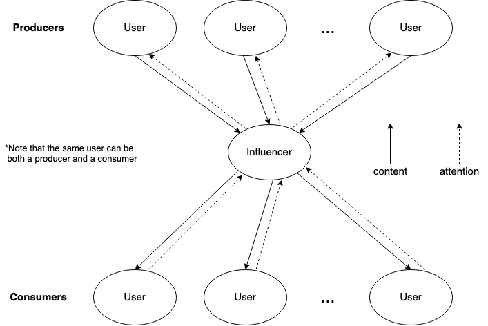

# Table of Contents

- [Introduction](#introduction)
- [Preface](#preface)
- [High-Level Code Organization](#high-level-code-organization)
- [Implementation](#implementation)
- [Additional Design Decisions](#additional-design-decisions)

# Introduction

In this project we aim to analyze content relationships in a network by calculating a value representing the amount of influence between any two agents.
For our purposes, an agent could be simply a single user or a set of users in a community.

More broadly, the goal of the project is to advance the understanding of social influence as a key feature of social media and a core mechanism underlying some of the main challenges emerging from the growing use of social media, including polarization, misinformation and disinformation, and the mental health crisis.
Specifically, we will test the hypothesis -- debated by sociological theorists but not empirically tested -- that social influence can be understood as a generalized (social) system of interchange, analogous to money or power.
Specifically, the project studies influence as a general system of interchange where attention and content are traded.

# Preface

In order to analyze influence between nodes we begin by using a game-theoric approach to model a social community based on the paper [Structure of Core-Periphery Communities](https://arxiv.org/abs/2207.06964).
The results of the paper show that, if the model is correct and the assumptions are sound, in equilibrium:

1. a community has a set of core agents (influencers) that follow all periphery agents (other users) in the community.
   The core agents then server as a "hub" for the community by collecting and aggregating content and broadcasting it to others in the community.
2. periphary agents all follow the core agents.
2. periphary agents also follow other periphery agents whose main interest closely matches their own interest.

Note: to simplify the analysis, the paper assumes that there exists a single core agent. This assumption is also motivated by the experimental results which show that core-periphery communities tend to have a small set of core agents, typically in the order of 1-6 core agents. Additionally, the results obtained for a single core agent can be extended to the case of multiple core-agents.

We define a content market for a community of users abstractly as a market where content is exchanged for attention.
A community is comprised of producers of content and consumers of content.
Therefore, going from the results above, we can describe the trade flow:

- **flow of content**: starts from producer nodes, going through the core node and then reaching the consumer nodes.
- **flow of attention**: starts from the consumer nodes, goes through the core node to reach the producer nodes.

The following graph illustrates this idea:

Note that in a real social-media scenario, a user is usually both a consumer and a producer to some degree.
For the sake of this project, we thus consider a user as both a distinct producer and a distinct consumer within the community. See [Additional Design Decisions](#additional-design-decisions) for a discussion on the above.
The former is characterized only by the user's original tweets and also their retweets that are further retweeted within the community, and the latter is characterized only by the user's retweets.

## Influence

The definition of social influence is not trivial. Here however, we reason that influence is a measure directly correlated to **uncertainty**.
This is intuitive as, for example, someone fully certain about a given subject would not be influenced by other's views upon that topic.
On the other hand, someone uncertain would appreciate as much information from other's view in that matter for their own decisions in order to reduce unceirtanty.

In our context, the uncertainty comes into play with content demand. Naturally, any user wants to have their content seen by as many other users as possible.
More importantly, as a core node, your broadcasting power is directly impacted by the interest of the community.
Hence, we infer that the content consumers as a whole have an influence over the core node based on their interests (the tweets they decide do retweet).
Moreover, the core node serves as an aggregation of the community's demand and, in the same fashion, content producers are interested in posting content that will be broadcasted by the core node.
Therefore, there exists yet another influence relationship of the core node over the content producer.

## Demand & Supply

To be explicit on what we refer to as demand and supply from now onwards, we define four distinct entities:

1. the demand from a user: the content that they retweet
2. the supply of a user: the content that they tweet about
3. the demand of a user: the aggregation of demand from other users on this user's supply (what is demanded of that user)
4. the supply to a user: the aggreation of supplies of their followings (what is supplied to the user)

However, when we say demand and supply, we refer to entities 1 and 2 above unless otherwise noted. 

Additionally, we have that demand and supplies can also be aggregated to more than one user.

## Hypothesis

Hence our iterated goal with this project is to verify the following hypotheses:

1. demand from the consumers **causes** supply of the core node
2. demand from the core node **causes** supply of the suppliers

Note, we also investigate the casuality between all permutations of demands and supplies between producers, consumers, and core nodes.

# High-Level Code Organization

In our code, we take a Object-Oriented Approach that is primarily reliant on the following classes:

## Content Market

A content market represents the space in which users of a community exchange content and attention. It is defined with respect to a community and its core node, and is used to manage and perform analysis on said entities.
It holds the following information:

- users: the users within the community
- core_node: the core node of the community
- computed_causations: A mapping of (users1, users2, start_time, end_time) to causations. This is updated as these values are computed on demand.

It provides functions that calculate:

- **Demand** for a given content embedding, set of users and time range. In plain English, demand is the number of retweets this user has posted about a certain topic within this time range.

- **Supply** for a given content embedding, set of users and time range. In plain English, supply is the number of tweets this user has posted about a certain topic within this time range combined with the number of retweets that this user posted and got retweeted by at least one other user that follows them (in this case, the retweet acts as an original tweet).

- **Causation** between any two values of demand or supply given a content embedding.

The functions above are more rigorously defined as following:

> We restrict "content" to be simply represented by a string. Then, for an abstract content piece $c$ (defined next), let $s_c$ denote its string representation. Let $n \in \mathbb{N}$.
>
> ### Content
>
> We first introduce the concept of a (discrete) latent space $S \subseteq \mathbb{R}^n$ to capture the relationship of tweet semantics. Then, for a string of content $s_c$, we loosely define content $c \in S$ as a point in space that represents the semantic meaning of $s_c$. Let a time interval be denoted by $T \subseteq \mathbb{R}$.
>
> Let
>  
> - $\mathcal{T}_{u, T}[P(x)]$  
> - $\mathcal{R}_{u, T}[P(x)]$
> 
> denote the set of tweets and retweets from user $u$ in time period $T$ where predicate $P(x)$ holds true respectively.
>
> ### Demand
>
> **INDIVIDUAL DEMAND**
>
> For a user $u \in U$ and time period $T$, we define the demand function $D_{u, T}: S \to \mathbb{R}$ as:
> 
> $$D_{u, T}(c) = |\mathcal{R}_{u, T}[c' \in S: ||c' - c|| < R]|$$
>
> For a $R \in \mathbb{R}$
>
> **INFLUENCER DEMAND**
>
> Note that for an influencer $i \in \mathcal{I} \subseteq U$, we define their demand to be the same as for any other user $u \in U$.
>
> **GROUP DEMAND**
>
> For a group of users $G \subseteq U$ and time period $T$, the aggregate demand $D_{G} \in \mathbb{R}$ of $G$ is defined as:
>
> $$D_{G, T} (c) = \sum_{u \in G} D_{u,T}(c)$$
>
> Additionally, the group's average demand is defined as:
>
> $$\tilde{D}_{G, T} (c) = \frac{D_{G,T}(c)}{|G|}$$
>
> ### Supply
>
> **INDIVIDUAL SUPPLY**
>
> For a user $u \in U$ and time period $T$, we define the supply function $S_{u, T}: S \to \mathbb{R}$ as:
> 
> $$S_{u, T}(c) = |\mathcal{T}_{u, T}[c' \in S:||c' - c|| < R]| + |\mathcal{C}_{u, T}[c' \in S:||c' - c|| < R]|$$
>
> For a $R \in \mathbb{R}^n$.
>
> Here, $\mathcal{C}_{u, T}[c' \in S:||c' - c|| < R]$ denotes "retweets in community" which is the number of retweets of $u$'s tweet by users that follow $u$ and with a post time after the corresponding tweet of $u$.
>
> **INFLUENCER SUPPLY**
>
> Note that for an influencer $i \in \mathcal{I} \subseteq U$, we define their supply to be the same as for any other user.
>
> **GROUP SUPPLY**
>
> For a group of users $G \subseteq U$ and time period $T$, the aggregate supply $S_{G} \in \mathbb{R}$ of $G$ is defined as:
>
> $$S_{G, T} (c) = \sum_{u \in G} S_{u,T}(c)$$
>
> Additionally, the group's average supply is defined as:
>
> $$\tilde{S}_{G, T} (c) = \frac{S_{G,T}(c)}{|G|}$$
>
> ### Granger Causality
>
> From researching in the literature we found that Granger causaility is one of the most widely used and simple to understand models of inferring causality. To put it briefly, a time series $X$ is said to Granger-cause $Y$ if it can be shown, usually through a series of $t$-tests and $F$-tests on lagged values of $X$ (and with lagged values of $Y$ also included), that those $X$ values provide statistically significant information about future values of $Y$.
>
> **Autoregressive Model**
>
> An autoregressive (AR) model is a representation of a type of random process; as such, we will be using it to fit a model of our caused time series $Y$.
>
> **Pure Autoregressive Model**
>
> More formally, we define a "pure" autoregressive model as a predictor $Y_t$ for a time $t$ where:
>
> $$Y_t = \sum_{i} y_i Y_{t-i} + \varepsilon_t$$
>
> for coefficients $x_i, y_i \in \mathbb{R}$ and white noise (error) $\varepsilon_t$.
>
> **Impure Autoregressive Model**
>
> Additionally, we define an "impure" autoregressive model as a predictor $Y_t'$ for a time $t$ where:
>
> $$Y_t' = \sum_{i} (y_i Y_{t-i} + x_i X_{t-i}) + \varepsilon_t$$
>
> for coefficients $x_i, y_i \in \mathbb{R}$ and white noise (error) $\varepsilon_t$ where $\exists i, \ x_i \neq 0$.
>
> **Granger Causality \& Autoregression**
>
> We therefore say that $X$ is said to Granger-cause $Y$ if $Y_t'$ provides a better autoregressive model.
>
> **t-Test and F-Test**
>
> Not going too far into the theory as we will be using python libraries to fit the autoregressive models, but the coefficients/variables in the autoregressive model are acquired by a combination of $t$-tests and $F$-tests. Any particular lagged value of one of the variables $X_{t-i}$ or $Y_{t-i}$ is retained in the regression if (1) it is significant according to a [$t$-test](https://en.wikipedia.org/wiki/Student%27s_t-test), and (2) it and the other lagged values of the variable jointly add explanatory power to the model according to an [$F$-test](https://en.wikipedia.org/wiki/F-test).
>
> **Granger Causality with Demand and Supply**
>
> Since Granger causality assumes time series data of real variables instead of functions and our initial goal is to find the causality between demand and supply functions, we will preemptively fix a content $c$ with corresponding $R$ in our demand/supply histogram data and perform the time series analysis above in various time snapshots of demand and supply for that particular $c$ across time $t$.
>
> We will then find the Granger-causality across the entire latent space of content by aggregating each individual fixed content causality.
>
> We will use the mean to aggregate the granger causality across the entire latent space of content. 

Values are computed on demand, output to the user, and stored in a `content_market` database. This has two purposes: 1) it allows values to be cached to reduce the time of future queries, and 2) It allows the `content_market` database to act as an output of our project, so that future research can populate certain content markets and then operate additional experiments using these content markets as input.

## Content Tweet

A content tweet object holds data about a tweet with respect to the following information:

- id
- user_id
- timestamp: timestamp of tweet
- user: user who tweeted
- is_retweet: true if this tweet is a retweet of another tweet; false otherwise
- retweets: retweets of this tweet
- content_vector: the embedding representation of the tweet's content, which is defined as a higher dimensional array in a latent space of content (see details in [Implementation](#implementation)).

## Content Market User

A Content Market User object holds data about a User in the context of the Content Market, with respect to the following information:

- id
- followers: users that follow this user
- following: users that this user is following
- tweets: the original tweets of this user
- retweets: the retweets of this user
- retweets in community: the retweets of this user's tweets or retweets by users that follow this user and with a post time after the corresponding tweet/retweet of this user (check who retweeted my retweet/tweet based on the timestamp and if the user follows me).

Additionally, it holds functionality to compute the demand and supply (as described in [Implementation](#implementation)).

## DAO

The DAO objects acts as an interface with MongoDB, allowing us to seperate the database accesses with our high level object definitions, giving us resiliciency to data definition changes and seperating database accesses from the responsbility of our objects. See [Data Ingestion](#data-ingestion) for details on how these databases are populated.

# Implementation

## High-Level OOP Diagram

## Latent Space Embedding

We rely on previous literate for latent space embedding of our model, namely [tweet2vec](https://arxiv.org/abs/1605.03481).
For starters, this approach assumes that posts with the same hashtags should have embeddings which are close to each other.
Hence, the authors train a Bi-directional Gated Recurrent Unit (Bi-GRU) neural network with the training objective of predicting hashtags for a post from its latent representation in order to verify latent representation correctness.

The dataset used for training the model consists of over 2 million global tweets in English between the dates of June 1, 2013 to June 5, 2013 with at least one hashtag.
This could impose a bias in the data where the model performs differently on posts without hashtags.
As such, we allow our program to easily integrated other embedding techniques for comparison.

We thus consider trying two further approaches:

1. Averaging the word embedding vectors of every word in a tweet
2. Training a new tweet2vec encodder based strictly on our community's tweets

## Demand / Supply Functions

The supply and demand functions are represented as a hashtable that maps a tuple of size n to its respective quantity of demand/supply, where n is the dimension of the latent space.
An n-tuple corresponds to a 'bin' or space in $R^n$, which are equal in size and aligned on non-overlapping intervals (for example, bin 1 may be a hypercube of size 1 centered at the zero vector, bin 2 a hypercube of size 1 centered at the $\vec{1}$, and so on until all tweets are encompassed within a hypercube).
We have a utility function which maps a given content vector to key / n-tuple that corresponds to the bin containing the vector. The support of the function is the keys in the hashtable, as only bins with non-zero demand or supply are keys.

### Storing Tweets

In order to retrieve demand and supply information more efficiently, we store tweets in the User class (for the fields <tweets>, <retweets> and <retweets in community>) in an n-tuple dictonary explained above for each of the three fields.
This allows any algorithm traversing tweet data to only consider the tweets that are within the boundaries of the content interval we defined for any given content while also allowing for iterating over the entire dictionary if needed.

## Causality

To infer causality (influence) between nodes, we capture supply and demand data over time, and use granger causality to infer if there is any relationship between the time series. We use [this module](https://www.statsmodels.org/dev/generated/statsmodels.tsa.stattools.grangercausalitytests.html) to implement the granger causality function.

### Implementation

Recall that in our implementation of supply and demand functions, we have partitionined the $R^n$ space of content embeddings into non-overlapping hypercubes. Each non-empty hypercube represents a key in our hash table, its value representing the supply/demand information.

Over time, we can construct time series of supply and demand in each bin, and calculate the granger causality for each bin for a given time period. Since we know that calculating granger causality will output a value between 0 and 1, we can augment this information in the hash table, corresponding to each key(bin). We will then find the mean to aggregate the granger causality across all bins.

### Creating Time Series

First, we will outline an approach to constructing the time series for the supply of a particular user. 

First, I will outline a way to find the support of the function. For a user $U$, recall that we can access the content vector embeddings for their tweets. Since there is a finite number of tweets for each user, $U$ has a tweet embedding with maximum norm $r$. We can create an open neighbourhood of radius $r$ centered at the origin, such that it involves tweets with norms smaller than or equal to $r$. Since $r$ is the maximum norm, it is guaranteed that all tweets of $U$ are contained inside the open ball. Since we have divided the space into non-overlapping hypercubes, we know that the open ball is segmented into a finite number of hypercubes. We have thus narrowed down the space into a finite number of hypercubes, narrowing down the support of the function. We can now iterate through the hypercubes, checking which of them are non-empty to find the support. 

For each hypercube, we can aggregate the number of tweets located in it at time interval t in a $(t, n)$ tuple, where t refers to the time interval and n refers to the supply, or the number of tweets in a hypercube for user $U$.After $M$ time intervals, we can see how the supply of user $U$ (n) changes over time.  

Time series for demand can be constructed using a similar method. 

## Data Ingestion

We are using logic from [SNACES](https://github.com/SNACES/core) to 1) collect twitter user data 2) collect tweet data 3) detect a community and core node. Once this data is loaded into the databases as defined by SNACES, we have several scripts that ingest the data from these databases, perform transformations (such as building users' followers lists), and then saves it into the databases used by this project. There are 3 databases corresponding to the main 4 objects of this project: ContentMarket, ContentMarketUser, ContentMarketCoreNode, and ContentTweet.

# Additional Design Decisions

## Causality

We want to generalize the granger causality across all bins, which can be done through multiple approaches. Some proposed approaches are: by calculating the mean, euclidean norm, or p-norm for any given p $\in Z^+$. For all of these approaches, the preliminary stages are the same - iterate through the keys(bins) in our hash table and get the granger causality (value between 0 and 1) of all of them. Notice that since we only have bins with non-zero supply/demand values, we have finitely many of them, making it possible to iterate through all of them. Now that we have the granger causality data for all bins, we can find a way to see patterns in the data and infer causality across all non-zero bins in the $R^n$ space.

We will explore some of our approaches here: We can calculate the mean of the granger causality in all bins, giving us an average across all non-zero bins in the $R^n$ space. An alternate approach would be to calculate the p-norm, and normalizing the output so that it lies between 0 and 1. The norm is able to capture different patterns in the data - for example, a 2-norm (or the euclidean norm) will skew values closer to 0 further towards 0, and values closer to 1 will be skewed less. The higher p gets, the higher the skewing gets.

We will use the mean to find the aggregate in our approach, as it is a more cost-effective and gives a decent estimate. 

## Users as Both Producers and Consumers

We had the decision on how to define Producers and Consumers. We considered treating a user as 1) both a producer and consumer 2) either a producer or consumer or 3) exclusively a producer or consumer.

The latter two cases would require us to enforce metrics that would segregate users into one of the two cateogries. We considered options such as 1) looking at the ratio between a user's supply and demand 2) looking at the absolute supply and demand of a user relative to the rest of the community.

We ended up going with option 1, treating users as both, because it allowed us to not impose any assumptions on the data. We found it too arbitrary to attempt to qualify someone as a producer or consumer at this stage. It also means we consider all content and demand in our calculations - while this could be a positive or a negative in terms of representing the model accurately, we do not have strong enough evidence that filtering out data is beneficial so we would rather have all of it.

## Supply

When defining a user's supply, we considered whether to include retweets in addition to original tweets. Our thinking against doing so was that retweets simply share the content of others, and are already being used as a metric of demand (which feels diametrically opposed to supply). However, when considering that many actors (such as influencers) use retweets to propogate content around a community, we felt it makes more sense to consider shared retweets as part of a user's supply.
