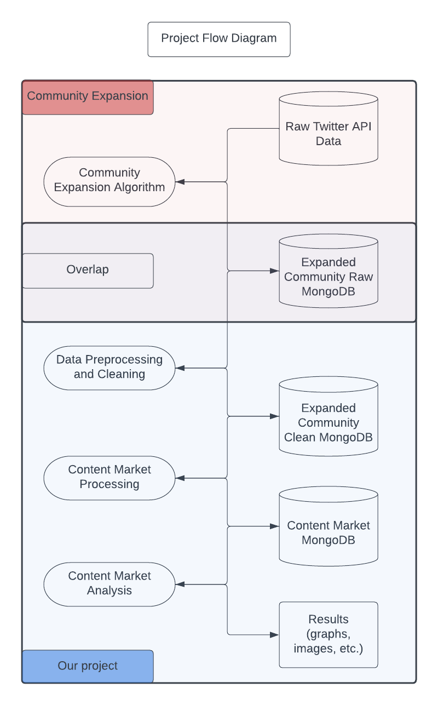
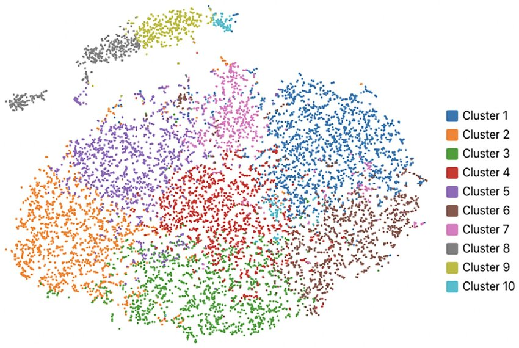
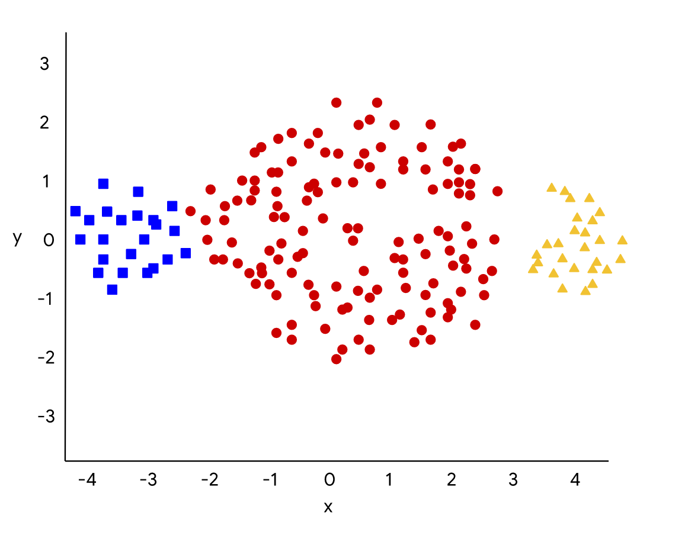
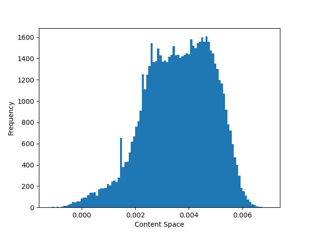
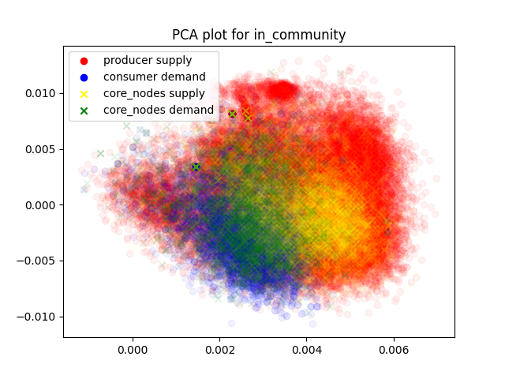

# Table of Contents

1. [Running the Code](#running-the-code)
2. [Introduction](#introduction)
3. [Preface](#preface)
    - [Influence](#influence)
    - [Demand & Supply Distinction](#demand--supply-distinction)
    - [Hypothesis](#hypothesis)
4. [Project Context](#project-context)
    - [Previous Work](#previous-work)
5. [Contributions](#contributions)
6. [Further Theory](#further-theory)
    - [Content](#content)
    - [Content Clustering](#content-clustering)
    - [Definitions](#definitions)
    - [Inferring Causality](#inferring-causality)
7. [High-Level Code Organization](#high-level-code-organization)
    - [Content Market](#content-market)
    - [Content Tweet](#content-tweet)
    - [Content Market User](#content-market-user)
    - [Content Market Producer](#content-market-producer)
    - [Content Market Consumer](#content-market-consumer)
    - [Content Market Core Node](#content-market-core-node)
    - [Content Market Clustering](#content-market-clustering)
    - [Content Market Embedding](#content-market-embedding)
    - [DAO](#dao)
8. [Implementation](#implementation)
    - [High-Level Diagram](#high-level-diagram)
    - [Latent Space Embedding](#latent-space-embedding)
    - [Content Clustering](#content-clustering-1)
    - [Demand / Supply Functions](#demand--supply-functions)
    - [Causality](#causality)
    - [Data Ingestion](#data-ingestion)
    - [Configurations](#configurations)
9. [Additional Design Decisions](#additional-design-decisions)
    - [Producers & Consumers Distinction](#producers--consumers-distinction)
    - [Defining Supply](#defining-supply)
    - [Causality Across Content Topics](#causality-across-content-topics)
10. [Code Walkthrough](#code-walkthrough)
11. [Example Results](#example-results)

# Running the Code

The main contents of the project are under the `/src` folder, and instructions to set up and run the program are found on the `INSTRUCTIONS.md` file in `/src`.
To run the code you may start there and follow the instructions on that `INSTRUCTIONS.md` file.

At some point in the set up process, you might need to generate tweet embeddings using `tweet2vec` (taken from [here](https://github.com/bdhingra/tweet2vec/)).
Due to python versioning conflicts, `tweet2vec` has its own set of set up instructions on the `INSTRUCTIONS.md` file under the `/tweet2vec` folder.
However, the set up under `/src/INSTRUCTIONS.md` should give enough context and instructions to guide you through the other set up as well.

# Introduction

In this project our end goal is to provide a framework to analyze in practice and verify the theoretical ground proposed in [Structure of Core-Periphery Communities](https://arxiv.org/abs/2207.06964) by studying how agents in a community influence each other with the content consumed and/or produced in a social network.

More broadly, the aim of the project is to advance the understanding of social influence as a key feature of social media and a core mechanism underlying some of the main challenges emerging from the growing use of social media, including polarization, misinformation & disinformation, and the mental health crisis.
Specifically, we will test the hypothesis - debated by sociological theorists but not empirically tested - that social influence can be understood as a generalized (social) system of interchange, analogous to money or power. In other words, the project studies influence as a general system of interchange where attention and content are traded.

# Preface

In order to analyze influence relationships between nodes we begin by using a game-theoric approach to model a social community. The theory behind this approach is derived on the paper [Structure of Core-Periphery Communities](https://arxiv.org/abs/2207.06964).
The results of the paper show that, if the model is correct and the assumptions are sound, in equilibrium:

1. a community has a set of core agents (influencers) that follow all periphery agents (other users) in the community. The core agents then serve as a "hub" for the community by collecting and aggregating content and broadcasting it to others members of the community.
2. periphary agents all follow the core agents.
3. periphary agents also follow other periphery agents whose main interest closely matches their own interest.

_Note: to simplify the analysis, the paper assumes that there exists a single core agent. This assumption is also motivated by the experimental results which show that core-periphery communities tend to have a small set of core agents, typically in the order of 1-6 core agents. Additionally, the results obtained for a single core agent can be extended to the case of multiple core-agents._

We define a content market for a community of users abstractly as a market where content is exchanged for attention.
A community is comprised of producers of content and consumers of content.
Therefore, going from the results found in the theory above, we can describe the trade flow as follows:

- **Flow of content**: content starts from producer nodes, goes through the core node and reaches the consumer nodes.
- **Flow of attention**: attention starts from the consumer nodes, goes through the core node and reaches the producer nodes.

The following graph illustrates this idea more visually:

    

Note that in a real social-media scenario, a user is usually both a consumer and a producer to some degree.

A **producer is characterized by the user's original tweets**, which reveals what content the producer posts to the community.

A **consumer is characterized by the user's retweets**, which revelas what content the consumer is interested in consuming. Note that we could additionally use other measures of attention, such as likes, replies, scroll behaviour, etc. However, the use of retweets as a form of demand is the simplest form that most resembles real social interactions given that we reproduce content we pay attention to.

## Influence

The definition of social influence is not trivial. Here however, we reason that influence is a measure directly correlated to **uncertainty**.
This is intuitive as, for example, someone fully certain about a given subject would not be influenced by other's views upon that topic.
On the other hand, someone uncertain would value as much information for their own decisions in order to reduce their unceirtanty. Hence the influence relationship arrising with anyone knowledgeble in that uncertain topic.

In our context, the uncertainty comes into play with content demand. Naturally, any user wants to have their content seen by as many other users as possible.
More importantly, as a core node, your broadcasting power is directly impacted by the interest of the community.
Hence, we infer that the content consumers as a whole have an influence over the core node from their interest choices (the tweets they decide do retweet - i.e. pay attention to).
Moreover, the core node serves as an aggregation of the community's demand and, in the same fashion, content producers are interested in posting content that will be broadcasted by the core node.
Therefore, we reason that there exists yet another influence relationship between the core node over the content producer.

## Demand & Supply Distinction

To be explicit on what we refer to as demand and supply from now onwards, we define four distinct entities:

1. the demand **from** a user: the content that they retweet
2. the supply **of** a user: the content that they tweet about
3. the demand **of** a user: the aggregation of demand from other users on this user's supply (what is demanded of that user)
4. the supply **to** a user: the aggreation of supplies of their followings (what is supplied to the user)

However, when we say demand and supply, we refer to entities 1 and 2 above (i.e. the demand **from** a user and  the supply **of** a user) unless otherwise noted.

Additionally, we have that demand and supplies can also be aggregated to more than one user.

## Hypothesis

Hence our iterated goal with this project is to verify the following hypotheses:

1. demand from the consumers **causes** supply of the core node
2. demand from the core node **causes** supply of the suppliers

Note, we also investigate the casuality between all permutations of demands and supplies between producers, consumers, and core nodes.

# Project Context

This project assumes that we already located a community of users (e.g the AI community on Twitter or the Chess community on Twitter) and that all the following relevant fields are populated in a Mongo database that we have access to:

- **users**: set of users that belong to the community. In addition to metadata ('num_following', 'num_followers', etc), each user has a list of user ids for 'following_in_community' and 'followers_in_community' of only the members in the community so that we can "reconstruct" the community connections graph if needed.
- **original_tweets**: set of "original tweets" made by members of this community, that are not a retweet nor reply
- **quotes_of_in_community**: quotes from someone in this community of original tweets made by members of this community
- **quotes_of_out_community**: quotes from someone in this community of a tweet made by someone outside this community
- **retweets_of_in_community**: retweets from someone in this community of original tweets made by members of this community
- **retweets_of_out_community**: retweets from someone in this community of a tweet made by someone outside this community

More broadly, the project has the following structure:

  

## Previous Work

From the raw twitter data scrapped with Twitter's API, the data goes through an initial processing analysis for community detection that is beyond the scope of this project. For the sake of context and full understanding, however, it is worth mentioning here.

The community detection/expansion algorithm leverages [SNACES](https://github.com/SNACES/core) (a Python library for downloading and analyze Twitter data) to search for and download a community of choice. The full details of this process are explained [here]() (TODO: relative link to Yanke's report or Anthony's outdated report), but we summarize the key steps here.

Let's say we are interested in analyzing the AI community. We begin by manually selecting an initial set of users of which we know for a fact are in this community. For the sake of our example, we select Geoffrey Hinton, Yoshua Bengio and Yann LeCun for their Turing Award winning work in the foundation of modern AI. Our algorithm then analyzes the users followed by 

TODO: outline community expansion steps

# Contributions

In order to ease the analysis of twitter data in the context of the our theory background and facilitate the study of the data we have, this project implements the architecture to process a content market. A content market is defined with respect to a specific community and is a concept to represent the abstract means in which the members of this community exchange content for attention. 

This content market implementation aims at providing all the functionality needed to analyze the relationships that we are focusing on. For that, it precomputes multiple values of interest and stores them back into a Mongo database for future access.

We also provide scripts to interpret and debug the content market as well as some initial scripts to analyze the data in the context of our research.  

# Further Theory

Going from the high-level mathematical model elaborated in [Structure of Core-Periphery Communities](https://arxiv.org/abs/2207.06964) to practical implementation and analysis of real world data requires further definitions and theory formulation of the various concepts used in this project.

## Content

We restrict "content" to be simply represented by a string. Then, for an abstract content piece $c$ (defined next), let $s_c$ denote its string representation. Let $n \in \mathbb{N}$.

We first introduce the concept of a latent space $S \subseteq \mathbb{R}^n$ to capture the relationship of tweet semantics. For a rigorous understanding of laten spaces, refer to [this article](https://towardsdatascience.com/understanding-latent-space-in-machine-learning-de5a7c687d8d) that explains laten space embeddings in a machine learning context similar to how we are using here. To put in simple terms, however, a latent embedding of our content (in our a case a tweet string) is an algorithm that embedds or "converts" a string to a vector in an $n$ dimensional space maintaining its semantic properties. That is, the location that this strings gets map to in this $n$-dimensional space represents the semantic meaning of the string in a way that other strings with similar semantic properties are mapped close (e.g. euclidean distance) to each other. The following image illustrates a 2D latent space where each datapoint is a tweet string and each cluster is a content tweeted about:

  

_For example, Cluster 1 could be tweets about sports and cluster 4 could be tweets about politics. Therefore, we notice that this embedding algorithm does a good job of maintaining the semantic properties of its content as most sports-related tweets are phisically located close to each other in that top-right cluster and politics-related tweets are located in the middle. Further notice that there is some overlap in red and blue custer, as for example, a tweet about sports could have a political conotation. Or even further, politics is located in the center of this embeddings space exactly because it can relate (and thus be located close) to many other topics._

## Content Clustering

Unfortunately, our data of tweets is not labeled and we can't precisely outline the boundaries of how wide a content topic ranges from in our embedding space. Ideally, we would partition our embedding space into an $n$-dimensional grid of hyper cubes of size $\delta \in \mathbb{R}$ and call each cube a different topic. 

TODO: picture

This is okay in a 2D latent embedding space like the one in the picture since the number of cubes (squares in that case) grows quadratically with the length of the embedding space. However, most embedding algorithms embedd in high dimensional spaces that could exceed 500 dimensions. This causes our number of hyper cubes (i.e. number of topics considered) to inscrease unreasonably for any feasable data analysis.

We then consider a few different approaches to go around this issue under the [Implementation](#implementation) section. For now, this general abstraction that we can partition our content space of tweets into different topics is sufficient.

## Definitions

For a string of content $s_c$, we loosely define content $c \in S$ as a point in space that represents the semantic meaning of $s_c$. Let a time interval be denoted by $T \subseteq \mathbb{R}$.

Let

- $\mathcal{T}_{u, T}[P(x)]$
- $\mathcal{R}_{u, T}[P(x)]$

denote the set of tweets and retweets from user $u$ in time period $T$ where predicate $P(x)$ holds true respectively.

**INDIVIDUAL DEMAND**

For a user $u \in U$ and time period $T$, we define the demand function $D_{u, T}: S \to \mathbb{R}$ as:

$$D_{u, T}(c) = |\mathcal{R}_{u, T}[c' \in S: ||c' - c|| < R]|$$

For a $R \in \mathbb{R}$

**INFLUENCER DEMAND**

Note that for an influencer $i \in \mathcal{I} \subseteq U$, we define their demand to be the same as for any other user $u \in U$.

**GROUP DEMAND**

For a group of users $G \subseteq U$ and time period $T$, the aggregate demand $D_{G} \in \mathbb{R}$ of $G$ is defined as:

$$D_{G, T} (c) = \sum_{u \in G} D_{u,T}(c)$$

Additionally, the group's average demand is defined as:

$$\tilde{D}_{G, T} (c) = \frac{D_{G,T}(c)}{|G|}$$

**INDIVIDUAL SUPPLY**

For a user $u \in U$ and time period $T$, we define the supply function $S_{u, T}: S \to \mathbb{R}$ as:

$$S_{u, T}(c) = |\mathcal{T}_{u, T}[c' \in S:||c' - c|| < R]| + |\mathcal{C}_{u, T}[c' \in S:||c' - c|| < R]|$$

For a $R \in \mathbb{R}^n$.

Here, $\mathcal{C}_{u, T}[c' \in S:||c' - c|| < R]$ denotes "retweets in community" which is the number of retweets of $u$'s retweet by users that follow $u$ and with a post time after the corresponding tweet of $u$ (this essentially means that the retweet, that was initially an indicator of demand, becomes an indicator of supply).

**INFLUENCER SUPPLY**

Note that for an influencer $i \in \mathcal{I} \subseteq U$, we define their supply to be the same as for any other user.

**GROUP SUPPLY**

For a group of users $G \subseteq U$ and time period $T$, the aggregate supply $S_{G} \in \mathbb{R}$ of $G$ is defined as:

$$S_{G, T} (c) = \sum_{u \in G} S_{u,T}(c)$$

Additionally, the group's average supply is defined as:

$$\tilde{S}_{G, T} (c) = \frac{S_{G,T}(c)}{|G|}$$

## Inferring Causality

From researching in the literature we found that Granger causaility is one of the most widely used and simple to understand models of inferring causality. To put it briefly, a time series $X$ is said to Granger-cause $Y$ if it can be shown, usually through a series of $t$-tests and $F$-tests on lagged values of $X$ (and with lagged values of $Y$ also included), that those $X$ values provide statistically significant information about future values of $Y$.

**Autoregressive Model**

An autoregressive (AR) model is a representation of a type of random process; as such, we will be using it to fit a model of our caused time series $Y$.

**Pure Autoregressive Model**

More formally, we define a "pure" autoregressive model as a predictor $Y_t$ for a time $t$ where:

$$Y_t = \sum_{i} y_i Y_{t-i} + \varepsilon_t$$

for coefficients $x_i, y_i \in \mathbb{R}$ and white noise (error) $\varepsilon_t$.

**Impure Autoregressive Model**

Additionally, we define an "impure" autoregressive model as a predictor $Y_t'$ for a time $t$ where:

$$Y_t' = \sum_{i} (y_i Y_{t-i} + x_i X_{t-i}) + \varepsilon_t$$

for coefficients $x_i, y_i \in \mathbb{R}$ and white noise (error) $\varepsilon_t$ where $\exists i, \ x_i \neq 0$.

**Granger Causality \& Autoregression**

We therefore say that $X$ is said to Granger-cause $Y$ if $Y_t'$ provides a better autoregressive model.

**t-Test and F-Test**

Not going too far into the theory as we will be using python libraries to fit the autoregressive models, but the coefficients/variables in the autoregressive model are acquired by a combination of $t$-tests and $F$-tests. Any particular lagged value of one of the variables $X_{t-i}$ or $Y_{t-i}$ is retained in the regression if (1) it is significant according to a [$t$-test](https://en.wikipedia.org/wiki/Student%27s_t-test), and (2) it and the other lagged values of the variable jointly add explanatory power to the model according to an [$F$-test](https://en.wikipedia.org/wiki/F-test).

**Granger Causality with Demand and Supply**

Since Granger causality assumes time series data of real variables instead of functions and our initial goal is to find the causality between demand and supply functions, we will preemptively fix a content $c$ with corresponding $R$ in our demand/supply histogram data and perform the time series analysis above in various time snapshots of demand and supply for that particular $c$ across time $t$.

We will then find the Granger-causality across the entire latent space of content by aggregating each individual fixed content causality.

We will use the mean to aggregate the granger causality across the entire latent space of content.

# High-Level Code Organization

In our code, we take a Object-Oriented Approach that is primarily reliant on the following classes:

## Content Market

A content market represents the space in which users of a community exchange content and attention. It is defined with respect to a community and its core node, and is used to manage and perform analysis on said entities.
It holds the following information:

- consumers: the consumers within the community
- producers: the producers within the community
- core_node: the core node of the community
- computed_causations: A mapping of (users1, users2, start_time, end_time) to causations. This is updated as these values are computed on demand.

It provides functions that calculate:

- **Demand** for a given content embedding, set of users and time range. In plain English, demand is the number of retweets this user has posted about a certain topic within this time range.

- **Supply** for a given content embedding, set of users and time range. In plain English, supply is the number of tweets this user has posted about a certain topic within this time range combined with the number of retweets that this user posted and got retweeted by at least one other user that follows them (in this case, the retweet acts as an original tweet).

- **Causation** between any two values of demand or supply given a content embedding.

Values are computed on demand, output to the user, and stored in a `content_market` database. This has two purposes: 1) it allows values to be cached to reduce the time of future queries, and 2) It allows the `content_market` database to act as an output of our project, so that future research can populate certain content markets and then operate additional experiments using these content markets as input.

## Content Tweet

A content tweet object holds data about a tweet with respect to the following information:

- id
- user_id
- timestamp: timestamp of tweet
- text: the text content of the tweet
- hashtags: the hashtags generated to represent the content of this tweet TODO: tales check this
- content_vector: the embedding representation of the tweet's content, which is defined as a higher dimensional array in a latent space of content (see details in [Implementation](#implementation)).

## Content Market User

The ContentMarketUser class represents a general user in a content market. It is the base class for `ContentMarketCoreNodes`, `ContentMarketConsumers`, and `ContentMarketProducers`. It contains the following fields:

- user_id: an integer representing the user's ID
- original_tweets: a list of integers representing the IDs of the original tweets posted by the user
- retweets_of_in_community: a list of integers representing the IDs of the retweets posted by the user within their community
- retweets_of_out_community: a list of integers representing the IDs of the retweets posted by the user outside their community
- quotes_of_in_community: a list of integers representing the IDs of the quotes posted by the user within their community
- quotes_of_out_community: a list of integers representing the IDs of the quotes posted by the user outside their community
- followers: a list of integers representing the IDs of the user's followers
- following: a list of integers representing the IDs of the users the user is following

Additionally, it holds functionality to compute the demand and supply (as described in [Implementation](#implementation)).

## Content Market Producer

The ContentMarketProducer class represents a Twitter user who produces content in the content market. It is a subclass of ContentMarketUser, and has one additional field:

- `supply`: a mapping for from cluster id to tweets ids of this user, which stores the support of this user

The `calculate_supply` method calculates the supply for this user by building support for their original tweets, quotes of tweets in the in-community, and quotes of tweets in the out-of-community.

## Content Market Consumer

The ContentMarketConsumer class is a subclass of ContentMarketUser that represents a Twitter user who is also a consumer in a content market. In addition to the properties inherited from ContentMarketUser, the ContentMarketConsumer class has three additional properties:

- `demand_in_community`: a dictionary that maps cluster IDs to lists of tweet IDs that the consumer has retweeted within the same community.
- `demand_out_of_community`: a dictionary that maps cluster IDs to lists of tweet IDs that the consumer has retweeted outside of their community.
- `aggregate_demand`: a dictionary that maps cluster IDs to lists of tweet IDs that represent the aggregate demand for each cluster from all consumers.

Additionally, it holds functionality to compute the demand and supply (as described in [Implementation](#implementation)).

## Content Market Core Node

The `ContentMarketCoreNode` class is a subclass of ContentMarketUser that represents an infleuncer in a content market. In addition to the properties inherited from ContentMarketUser, the `ContentMarketCoreNode` class has three additional properties:

- demand_in_community: A DefaultDict mapping cluster IDs to a list of tweet IDs representing the demand for content within the same cluster.
- demand_out_of_community: A DefaultDict mapping cluster IDs to a list of tweet IDs representing the demand for content outside of the same cluster.
- aggregate_demand: A DefaultDict mapping cluster IDs to a list of tweet IDs representing the aggregate demand for content within and outside of the same cluster.
- supply: A DefaultDict mapping cluster IDs to a list of tweet IDs representing the supply of content.

Additionally, it holds functionality to compute the demand and supply (as described in [Implementation](#implementation)).

## Content Market Clustering

`ContentMarketClustering` is an object that holds information about the clustering of tweets in the latent space. It has the following fields:

- tweet_to_cluster: a mapping of tweet ids from the community to the cluster they are assigned to
- cluster_centers: the n-dimensional centerpoint of each cluster
- radius: the radius of each cluster

## Content Market Embedding

A content market embedding stores information about the embeddings of the tweets in the community. It has the following fields:

- latent_space_dim: the dimesionality of the embeddings
- embedding_type: the embedding type used to embed the tweets
- tweet_embeddings: mapping of tweet id to embedding vector

## DAO

The DAO objects acts as an interface with our datastore. This gives us the ability to switch between storage solutions while maintaining a common interface, seperating the database accesses with our high level object definitions. Currently, we have a MongoDB DAO implementation, and recommend using Mongo as the data layer for this app and the overall research project.

TODO: See [Data Ingestion](#data-ingestion) for details on how these databases are populated.

# Implementation

## High-Level Diagram

## Latent Space Embedding

Latent embedding representation of words is ubiquitous in machine learning applications. However, embedding full sentences are much less prominent, let alone embedding tweets. This issue arises from the inherent nature of a tweet that is menat to be a casual string of text in which users often rely on the social context for using abbreviations, hashtags and making typos that cause most word to vector models to struggle for an accurate representation of the data. 

Therefore, for our project we rely on previous literate for latent space embedding of tweets, namely [tweet2vec](https://arxiv.org/abs/1605.03481).
For starters, this approach assumes that posts with the same hashtags should have embeddings which are close to each other.
Hence, the authors train a Bi-directional Gated Recurrent Unit (Bi-GRU) neural network with the training objective of predicting hashtags for a post from its latent representation in order to verify latent representation correctness.

The dataset used for training the model consists of over 2 million global tweets in English between the dates of June 1, 2013 to June 5, 2013 with at least one hashtag.
This could impose a bias in the data where the model performs differently on posts without hashtags.
As such, we allow our program to easily integrated other embedding techniques for comparison.

We thus consider trying two further approaches:

1. Averaging the word embedding vectors of every word in a tweet
2. Training a new tweet2vec encodder based strictly on our community's tweets

## Content Clustering

As explained in [Further Theory](#further-theory), our $\delta$-split of the latent space approach for content clustering is insufficient for our purposes. We then considered a few approaches to circunvent this issue.

1. **Modified K-means Clustering**
    
    K-means is also a widdely used clustering techique that randomly creates $k$ clusters and iteratively assigns vectors (datapoints) to their closest clustes as well as recenter the clusters until the algorithm converges and every datapoint is assigned to its "best" cluster. More rigorous details on its functionality can be found [here](https://en.wikipedia.org/wiki/K-means_clustering).

    The issue with the original k-means algorithm is that it does not guarantee consistent radius across clusters, which is an assumption we need for our demand and supply analysis. We then implement a modified k-means cluster that performs the following:

    >1. For a number of clusters k, initialize the cluster centers randomly.
    >2. Calculate the distance between each vector and each cluster center.
    >3. For each cluster, calculate the average distance from the cluster center to all the vectors assigned to the cluster.
    >4. Find the maximum average distance among all the clusters, and set this distance as the desired radius for all the clusters.
    >5. For each cluster, remove all vectors that are farther than the desired radius from the cluster center.
    >6. Recalculate the cluster centers as the means of the remaining vectors assigned to each cluster.
    >7. Repeat steps 2 to 6 until convergence (i.e., until the cluster centers do not change significantly).

    Notice that this does not guarantee that all datapoints will be assigned to a cluster. However, with a large enough $k$, this is actually a desired behaviour since this serves as filter of noise excluding outlying tweets that are too far from the interest of the community.

2. **Recursive K-means**

    A possible issue with the previous algorithm is when the data has varying sizes of clusters:

    

        
    

    For example, if red is the topic of sports and blue is AI, our modifed k-means would not split the clusters into topics their major topics, but it would likely instead split the sports cluster into soccer, basketball and football. This inconsistency across topic sizes could add bias to the data.

    We then discuss another approach that entails start from the [original k-means clustering](https://en.wikipedia.org/wiki/K-means_clustering) algorithm to identify high-level topics and then analyze each topic individually by performing the modifed k-means clustering of fixed radius individually for each topic to identify sub-topics. 

3. **Principal Component Analysis**

    The inherit issue with our initial $\delta$-split was the increase in dimensionality of latent embedding algorithms. What if we somehow project the embedding down to lower dimensions? That is exactly what we try to do with Principal Component Analysis (PCA). Again, a rigourous explanation can be found [here](https://en.wikipedia.org/wiki/Principal_component_analysis) and an intuitive video can be found in [this article](https://builtin.com/data-science/step-step-explanation-principal-component-analysis), but the idea behind this algorithm is to reduce the dimensionality of the data "inteligently" so as to preserve as much information about the data as possible. It is inherent that some information will be lost as a consequence of projecting vectors to lower dimensions, however, PCA takes the desired number of dimensions $d$ and identifies the "best" $d$ basis vectors to project the given data so as to lose the fewest amount of information. 

    From a lower dimensional dataset, we can more efficiently perform a $\delta$-split, or even visually the data directly in 1D, 2D or 3D projections.

    The following is a $\delta$-split of a one-dimensional embedding space: 

    

        
    

    Or we can visualize the latent space in 2D:

    

        
    

## Demand / Supply Functions

The supply and demand functions are represented as a hashtable that maps a tuple of size n to its respective quantity of demand/supply, where n is the dimension of the latent space.
An n-tuple corresponds to a 'bin' or space in $R^n$, which are equal in size and aligned on non-overlapping intervals (for example, bin 1 may be a hypercube of size 1 centered at the zero vector, bin 2 a hypercube of size 1 centered at the $\vec{1}$, and so on until all tweets are encompassed within a hypercube).
We have a utility function which maps a given content vector to key / n-tuple that corresponds to the bin containing the vector. The support of the function is the keys in the hashtable, as only bins with non-zero demand or supply are keys.

### Storing Tweets

In order to retrieve demand and supply information more efficiently, we store tweets in the User class (for the fields <tweets>, <retweetsand <retweets in community>) in an n-tuple dictonary explained above for each of the three fields.
This allows any algorithm traversing tweet data to only consider the tweets that are within the boundaries of the content interval we defined for any given content while also allowing for iterating over the entire dictionary if needed.

## Causality

To infer causality (influence) between nodes, we capture supply and demand data over time, and use granger causality to infer if there is any relationship between the time series. We use [this module](https://www.statsmodels.org/dev/generated/statsmodels.tsa.stattools.grangercausalitytests.html) to implement the granger causality function.

### Implementation

Recall that in our implementation of supply and demand functions, we have partitionined the $R^n$ space of content embeddings into non-overlapping hypercubes. Each non-empty hypercube represents a key in our hash table, its value representing the supply/demand information.

Over time, we can construct time series of supply and demand in each bin, and calculate the granger causality for each bin for a given time period. Since we know that calculating granger causality will output a value between 0 and 1, we can augment this information in the hash table, corresponding to each key(bin). We will then find the mean to aggregate the granger causality across all bins.

### Creating Time Series

First, we will outline an approach to constructing the time series for the supply of a particular user.

First, I will outline a way to find the support of the function. For a user $U$, recall that we can access the content vector embeddings for their tweets. Since there is a finite number of tweets for each user, $U$ has a tweet embedding with maximum norm $r$. We can create an open neighbourhood of radius $r$ centered at the origin, such that it involves tweets with norms smaller than or equal to $r$. Since $r$ is the maximum norm, it is guaranteed that all tweets of $U$ are contained inside the open ball. Since we have divided the space into non-overlapping hypercubes, we know that the open ball is segmented into a finite number of hypercubes. We have thus narrowed down the space into a finite number of hypercubes, narrowing down the support of the function. We can now iterate through the hypercubes, checking which of them are non-empty to find the support.

For each hypercube, we can aggregate the number of tweets located in it at time interval t in a $(t, n)$ tuple, where t refers to the time interval and n refers to the supply, or the number of tweets in a hypercube for user $U$.After $M$ time intervals, we can see how the supply of user $U$ (n) changes over time.

Time series for demand can be constructed using a similar method.

## Data Ingestion

\*\* should have a section where we talk about how this project integrates with the overall research

The required input to build a content market is a community.
** Insert definition of community here, talking about fields and all that. we shouldnt have to write this **

The output is a content market database, where the core nodes, consumers, and producers are written out as collections. Note that these contain all information about their tweet actions (their original tweets, retweets in community, etc), as well as their computed supplies and / or demands.

## Configurations

To run main.py, the path to a json config file must be passed in. This file must contain the following information:

TODO: chatgpt description of config here

# Additional Design Decisions

## Producers & Consumers Distinction

We had the decision on how to define Producers and Consumers. We considered treating a user as 1) both a producer and consumer 2) either a producer or consumer or 3) exclusively a producer or consumer.

The latter two cases would require us to enforce metrics that would segregate users into one of the two cateogries. We considered options such as 1) looking at the ratio between a user's supply and demand 2) looking at the absolute supply and demand of a user relative to the rest of the community.

We ended up going with option 1, treating users as both, because it allowed us to not impose any assumptions on the data. We found it too arbitrary to attempt to qualify someone as a producer or consumer at this stage. It also means we consider all content and demand in our calculations - while this could be a positive or a negative in terms of representing the model accurately, we do not have strong enough evidence that filtering out data is beneficial so we would rather have all of it.

## Defining Supply

When defining a user's supply, we considered whether to include retweets in addition to original tweets. Our thinking against doing so was that retweets simply share the content of others, and are already being used as a metric of demand (which feels diametrically opposed to supply). However, when considering that many actors (such as influencers) use retweets to propogate content around a community, we felt it makes more sense to consider shared retweets as part of a user's supply.

## Causality Across Content Topics

We want to generalize the granger causality across all content topics (referred to as bins or clusters), which can be done through multiple approaches. Some proposed approaches are: by calculating the mean, euclidean norm, or p-norm for any given p $\in Z^+$. For all of these approaches, the preliminary stages are the same - iterate through the keys(bins) in our hash table and get the granger causality (value between 0 and 1) of all of them. Notice that since we only have bins with non-zero supply/demand values, we have finitely many of them, making it possible to iterate through all of them. Now that we have the granger causality data for all bins, we can find a way to see patterns in the data and infer causality across all non-zero bins in the $R^n$ space.

We will explore some of our approaches here: We can calculate the mean of the granger causality in all bins, giving us an average across all non-zero bins in the $R^n$ space. An alternate approach would be to calculate the p-norm, and normalizing the output so that it lies between 0 and 1. The norm is able to capture different patterns in the data - for example, a 2-norm (or the euclidean norm) will skew values closer to 0 further towards 0, and values closer to 1 will be skewed less. The higher p gets, the higher the skewing gets.

We will use the mean to find the aggregate in our approach, as it is a more cost-effective and gives a decent estimate.

# Code Walkthrough

# Example Results

Putting our work into action, we identify a community and sample 12 months worth of tweets from that community.

TODO
